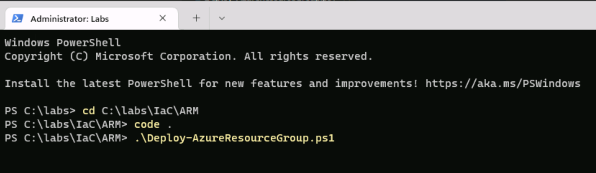
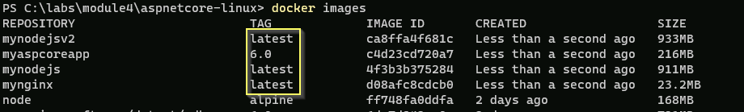
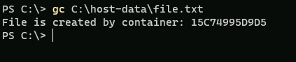
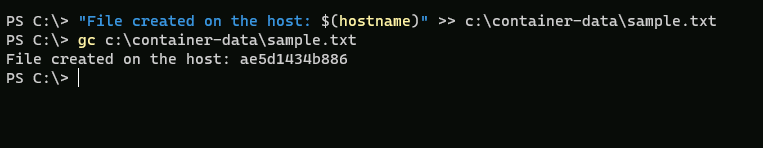
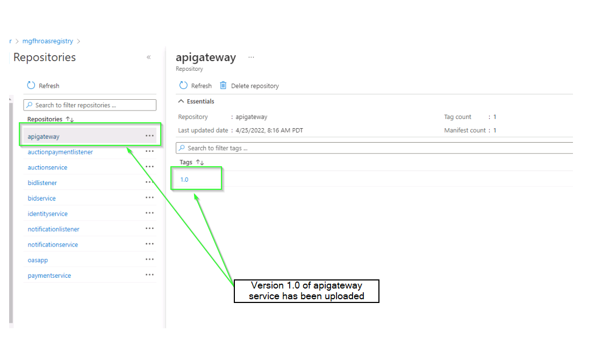
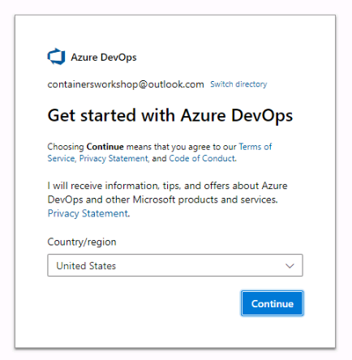
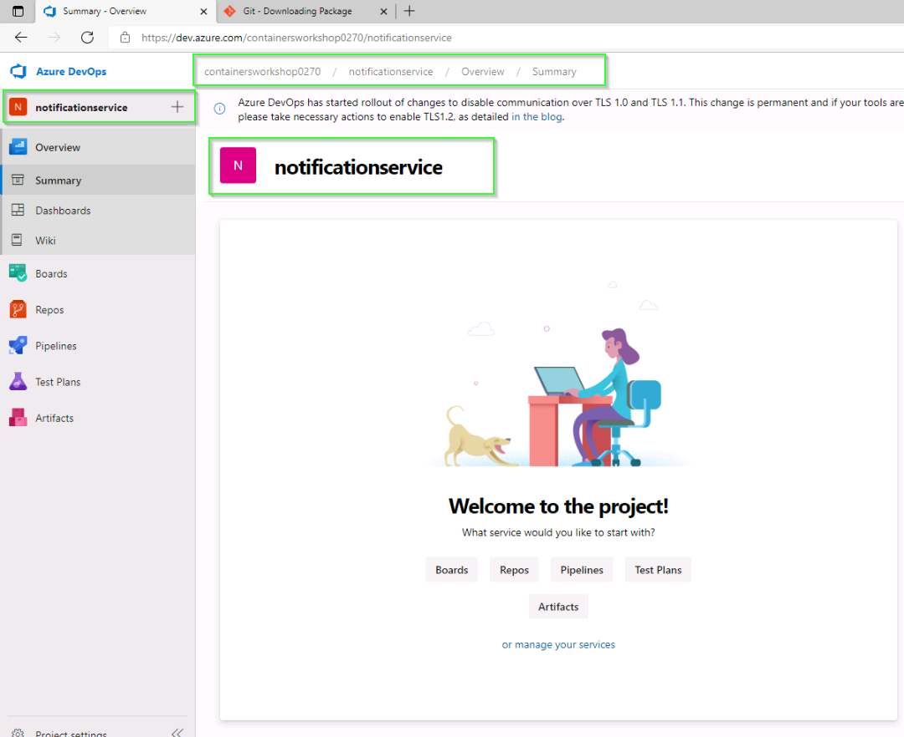
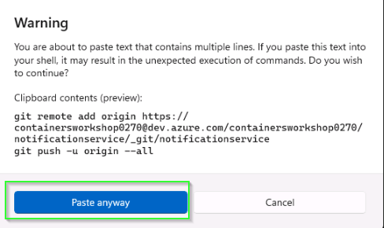
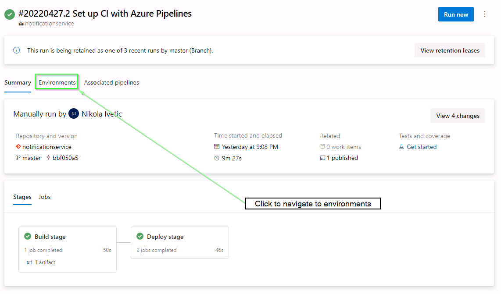
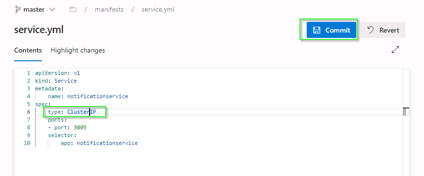

# WorkshopPLUS - Building Cloud-native Applications using Microservices Architecture


## Modules
[Module 1: Provision Azure services and explore Online Auction System](#module-1-provision-azure-services-and-explore-online-auction-system)

[Module 4: Container Core Concepts](#module-4-container-core-concepts)

[Module 5: Advanced Container Topics](#module-5-advanced-container-topics)

[Module 6: Container Hosting and Orchestration using AKS](#module-6-container-hosting-and-orchestration-using-aks)

[Module 7: DevOps with Containers](#module-7-devops-with-containers)

# Module 1: Provision Azure services and explore Online Auction System 

> Duration: 45 minutes or more

# Module 1: Table of Contents 

[Exercise 1: Provision Azure Services using ARM template](#exercise-1-provision-azure-services-using-arm-template)

### Prerequisites 

The Windows LOD VM is packaged with all of the required software to perform this lab. 

The lab files are required to complete the hands-on exercises and have been pre-downloaded on the Virtual Machine. 

## Exercise 1: Provision Azure Services using ARM template 

In this exercise you will provision all the services in Azure that are required to run the OAS (Online Auction System). You will further test the application by creating a sample auction item.

---
[Return to list of exercises](#module-1-table-of-contents)  - [Return to list of modules](#modules)

>Azure Resource Manager templates are JavaScript Object Notation (JSON) files that define the infrastructure and configuration for your project. Learn more at [ARM template](https://docs.microsoft.com/en-us/azure/azure-resource-manager/templates/)

Throughout the entire workshop, you will be using the same resources we provision here in the first module. To make the things more convenient, lets enter all those things as variables in the lab environment.

1. For resources used in later labs, you need to kick of a deployment script to deploy some Azure resources to your subscription. In your Windows Terminal enter:

   ``cd C:\labs\IaC\Bicep\ps`` 
   
1. You need to log in to Azure from the Windows Terminal.

    ``az login``

1. In case you have multiple Azure subscriptions, you need to make sure you select the subscription that will be used for this lab:

    ``az account list -o table``
    
2. Set the correct subscription.

    ``az account set -s "your-subscription-id"``

3. To make sure you have the correct permissions setup for your Windows Terminal PowerShell window, enter the following command.

    ``Set-ExecutionPolicy -ExecutionPolicy Bypass -Scope Process``

4. Run the command:

    ``.\Deploy.ps1 eastus``

1. The deployment process will take quite a while, but you can continue on with other labs. After the deployment is finished, if you look in your Azure subscription, you'll have a resource group named ``oas-msvcs-rg``. If you look inside of the resource group, you will be able to see all of the resources that were deployed.
   
    

1. Go back to the ``Windows Terminal`` and run the following command to set the execution policy. 

    ``Set-ExecutionPolicy -ExecutionPolicy Bypass -Scope Process``

    >PowerShell's execution policy is a safety feature that controls the conditions under which PowerShell loads configuration files and runs scripts. This feature helps prevent the execution of malicious scripts. On a Windows computer you can set an execution policy for the local computer, for the current user, or for a particular session.

1. Now run the deployment by executing the ``Deploy-AzureResourceGroup.ps1`` file from the ``Windows Terminal``. Make sure you are at the right folder path i.e. ``c:\labs\IaC\ARM``

    ``.\Deploy-AzureResourceGroup.ps1``
    
    

1. While it is provisioning resources, it will ask to login to Azure. Enter same credentials you've used to setup your Azure subscription.

1. PowerShell script provision services on Azure, setup databases for microservices and spin up the application as docker containers.

1. Once all the containers are up, you will find this log stating ``Angular Live Development Server is listening on 0.0.0.0:4200``. Access the website from browser by entering this URL ``http://localhost:4200``

    

1. Click on Login and enter credentials as follows: 

    Username: ``testuser@oas.com`` 

    Password: ``password``

    

1. Click on ``Create Auction`` option from the Home page to create auction.

    
    
1. Enter name of the auction, description, starting bid price and active for hours (set hour as ``1`` to test the payment flow later) and click on ``Save``.

    

1. A new auction will be created.

### Congratulations!

You have successfully completed this module. Click ``Next`` to advance to the next module.


# Module 4: Table of Contents 

[Exercise 1: Running Your First Container](#exercise-1-running-your-first-container)  

[Exercise 2: Building custom container s using Dockerfiles: Node.js, NGINX, .NET 6](#exercise-2-building-custom-container-s-using-dockerfiles-nodejs-nginx-net-6)  

[Exercise 3: Interaction with a Running Container](#exercise-3-interaction-with-a-running-container)  

[Exercise 4: Tagging](#exercise-4-tagging)  

### Prerequisites 

The Virtual Machine is packaged with all of the required software to perform this lab. 

The lab files are required to complete the hands-on exercises and have been pre-downloaded on the Virtual Machines. 


# Exercise 1: Running Your First Container 

In this exercise, you will launch a fully functional WordPress blog engine using a Linux-based Docker container. You will learn the commands needed to pull the container  and then launch the container using the Docker CLI. Finally, you will observe that by running the container, you don't need to install any of the WordPress dependencies onto your machine; the WordPress engine binaries and all dependencies will be packaged inside of the container.  


## Running WordPress Blog Engine Container

---
[Return to list of exercises](#module-4-table-of-contents)  - [Return to list of modules](#modules)  

1. From your taskbar, click on the Windows Terminal icon to open ``Windows Terminal``.

    

1. Type    ```docker pull msftcontainers/wordpress```

    >This will tell Docker client to connect to public Docker Registry and download the latest version of the WordPress container  published by msftcontainers (hence the format msftcontainers/wordpress). The container  has been pre-downloaded for you on the VM to save you a few minutes, so you will see the Status message as ``"s is up to date for msftcontainers/wordpress:latest"``.

    

1. Run the command  

    ``docker s``
    
    >Notice ``"msftcontainers/wordpress"`` container  is now available locally for you to use.  

    

1. That's it! You can now run the entire WordPress in a container. To do that run the command  ``docker run -d -p 80:80 msftcontainers/wordpress``  

    >Pay close attention to the dash ``"-"`` symbol in front of ``"-p"`` and ``"-d"`` in the command.

    

1. Run the following ``docker ps`` to see the running containers.

    

1. Click on the ``Microsoft Edge`` browser icon in the taskbar:

    

1. Navigate to ``http://localhost`` and you should see WordPress.

    

1. Let's launch two more containers based on ``"msftcontainers/wordpress"`` . Execute following commands (one line at a time)

   ``docker run -d -p 8080:80 msftcontainers/wordpress``
   
    ``docker run -d -p 9090:80 msftcontainers/wordpress``
   
    
   
1. Run ``docker ps`` to see all 3 running containers and their port numbers:

    

1. Now open a new browser window and navigate to URL (using DNS or IP as before) but with port "``8080``" append to it. You can also try port "``9090``". 
   
    >Notice that you now have three WordPress blog instances running inside separate containers launched within few seconds. Contrast this to instead creating and running WordPress on virtual machine, which could take significantly more time.

    

1. If you want to run a container with a name, you can specify the parameter like this:  

    ``docker run \--name mycontainer1 -d -p 8081:80 msftcontainers/wordpress``   

    >Run this on port ``8081`` so that it does not conflict with one of the previously running containers.

    

1. And, now if you run  ``docker ps``, you will see that the container has the name you assigned it using the "``\--name parameter``".

    

---

>Now, let's learn about common ``Docker commands`` needed to work with containers. 
To see a comprehensive list of docker commands available ``[click here] (https://docs.docker.com/engine/reference/commandline/docker) ``

1. First list all the containers currently running by executing ``docker ps`` command. You should see list of all running containers. 

    >Notice, the list contains multiple containers based on WordPress  that you ran previously.

    

1. You can stop a running container by using ``docker stop CONTAINER_ID`` command. Where ``CONTAINER_ID`` is the identifier of a running container. 
   
    >You can just use the first couple characters to identity the container ID, such as "``1c1``" from the sample screenshot above, or you can use the full container ID.


1. Type ``docker stop CONTAINER_ID`` to stop the container.

    

1. Now run the ``docker ps`` command and notice the listing show one less container running.

    

1. If you want see the Container ID of the stopped container, and you forgot the Container ID, you can run ``docker ps -a`` to see all containers, even those that are stopped/exited.

    

1. You can also issue command to ``start`` the container which was stopped. To start a container run ``docker start CONTAINER_ID``. 

    >This uses the container identifier you use in previous section to stop the container.

    )

1. To make sure that container has started successfully run ``docker ps`` command. 
    >Notice that WordPress container is now started.

    

1. Stopping a container does not remove it and that's the reason why you were able to start it again in the previous task.

    To ``delete/remove`` a container and free the resources you need to issue a different command. Please note that this command does not remove the underlying  but rather the specific container that was based on the . To remove the  and reclaim its resources, like disk space, you'll will need to issue a different command which is covered later.

1. To remove a container, run ``docker rm -f CONTAINER_ID`` command.

    

    >The "``-f``" switch is used to ``force`` the remove operation. It's needed if you are trying to remove a container that is not already stopped.

1. To validate that container has been removed completely run ``docker ps -a`` command. 
    >Note that container starting with the ID @lab.Variable(ContainerId1) is not in the list.

    


1. At times you may want to stop all of the running containers and avoid issuing command to stop one container at a time. Run ``docker stop $(docker ps -aq)`` command to stop all running containers. Basically, you are issuing two commands: First the ``docker ps`` with relevant switches to capture list of container IDs and then passing list of IDs to ``docker stop`` command.

    

1. Now that we stopped all the containers, we can remove the  (``msftcontainers/wordpress``) used to run the containers.  Removing a container  form a local system will let you reclaim its disk space. 
    >Please note that this operation is ``irreversible`` so proceed with caution. In this task you will remove the WordPress container  as you will not be using it any more. You must stop all containers using the  before you can delete the , unless you use the force parameter.

1. To remove a container , you'll need its  ID. Run command ``docker s``
   
    

1. Run the command ``docker rmi _ID -f`` 

    >Notice the command to remove docker container is "``docker rm``" and to remove an  is "``docker rmi``", with an 'i' for the . Don't confuse these two commands! The ``-f`` is to force the removal, you cannot remove an  associated with a stopped container unless you use the force parameter.

    

1. Now, run the command ``docker s`` 

    >Notice that "msftcontainers/wordpress"  is no longer available.

    

### Congratulations!

You have successfully completed this exercise. Click ``Next`` to advance to the next exercise.

## ``Exercise 2: Building custom container s using Dockerfiles: Node.js, NGINX, .NET 6``

A Dockerfile is essentially a plain text file with Docker commands in it that are used to create a new . You can think of it as a configuration file with a set of instructions needed to assemble a new . In this exercise, you will learn the common commands that go into Dockerfile by creating custom s based on common technologies like NGINX, Node JS and .NET.  

---
[Return to list of exercises](#module-4-table-of-contents) - [Return to list of modules](#modules)    

## Building and Running Node.JS Application as Container

In this task you will create a new  based on the Node.js base . You will start with a Dockerfile with instructions to copy the files needed to host a custom Node.js application, install necessary software inside the  and expose ports to allow the traffic. Later, you will learn how to build the  using Dockerfile and finally will run and test it out.

>The relevant files related to a node.js application along with the Dockerfile are available inside the directory ``"labs/module4/nodejs"``. 

1. From Windows Terminal navigate to the directory:

    ``cd C:\labs\module4\nodejs``

    

1. On the command prompt type ``ls`` and press ``Enter``. 
    >Notice the available files include "server.js", "package.json", "Dockerfile" and ".dockerignore".

    

1. Let's examine the Dockerfile by typing the command ``code Dockerfile`` and press ``Enter``.

    > The file is case sensitive, so make sure the D in Dockerfile is capitalized.

    > Dockerfile will open in Visual Studio Code for editing. Notice the structure of Dockerfile.

    

1. Find the line starting with ``LABEL author="sampleauthor@contoso.com"`` and change the email address to your own email. Once you finish making changes press save the file by pressing ``CTRL+S``, and close the Visual Studio Code.

    You are now ready to build a new  based on the Dockerfile you just modified.

1. Run the command ``docker build -t mynodejs .``

    >Pay close attention to the period that is at the end of command. 
    
    >Notice how the build command is reading instructions from the Dockerfile staring from the top and executing them one at a time. This will take a few minutes to pull the  down to your VM.

    

    >When it is complete, you might see a couple of npm warnings, you can ignore this.

1. Run the command 

    ``docker s`` 

    and notice the new container  appears with the name "``mynodejs``". Also notice the presence of parent  "``node``" that was also pulled from Docker Hub during the build operation (if you were using the provided lab machines, they may have already been cached locally).

   
1. Finally, lets create and run a new container based on "``mynodejs``" . Run command  
   
    ``docker run -d -p 8080:8080 mynodejs``  

    >The ``-d`` parameter will run the container in the background, whereas the ``-p`` parameter publishes the container port to the host. 
    
    >Here, we are binding the port of the container (port number on right-side of colon) to the port of the host machine (port number on the left-side of the colon).

    

1. To test the "``mynodejs``" application, go back to your Microsoft Edge browser and go to ``localhost:8080``.

    

### Congratulations!

You have successfully completed this topic. Click ``Next`` to advance to the building Nginx container .

# Building and Running NGINX Container

[Return to list of exercises](#module-4-table-of-contents) - [Return to list of modules](#modules) 

In this task you will create a new  using the NGINX web server base  hosting a simple static html page. You will start with a Dockerfile with instructions to define its base , then copy the static html file inside the  and then specify the startup command for the  (using CMD instruction). Later, you will learn how to build the  using Dockerfile and finally will run and test it out.

> The relevant files including static html file ``index.html`` along with the Dockerfile are available inside the directory ``labs/module4/nginx``. 

1. From Windows Terminal navigate to the directory:

    ``cd C:\labs\module4\nginx``

    

1. Type ``ls`` and press ``Enter``. Notice the available files include "``index.html``" and "``Dockerfile``".

    

1. Let's examine the Dockerfile by typing the command ``code Dockerfile`` and press ``Enter``. 

    >You can use any other text editor, but instructions are provided for Visual Studio Code. 
    
    >Notice the structure of Dockerfile.

    

1. Find the line starting with ``LABEL author="sampleauthor@contoso.com"`` and change the email address to your own email. Once you finish making changes press save the file by pressing ``CTRL+S``, and close the Visual Studio Code.  

1. You are now ready to build a new container  based on the Dockerfile you just modified.  
    Run the command 
    
    ``docker build -t mynginx .``

      

    >Notice how the build command is reading instructions from the Docker file starting from the top and executing them one at a time. The  will download much faster as this is a very small .

1. If you want to see the layers of an , you can do 

    ``docker history mynginx``

    and see the one you just built. You can also try running this command on other s you have on your VM too.

    
1. Run the command 

    ``docker s``

    >Notice the new container  appears with the name ``mynginx``. Also notice the presence of parent  ``nginx`` that was pulled from Docker Hub during the build operation. Take a look at the sizes of different s also. This will become important when you build your own custom s to reduce the size for both security and performance.  

    

1. Finally, create and run a new container based on "``mynginx``" . Run command 

    ``docker run -d -p 80:80 mynginx``

    

1. To test the node app, go to your ``Microsoft Edge`` browser and go to ``localhost``.

    

### Congratulations!

You have successfully completed this topic. Click ``Next`` to advance to the building ASP .NET Core Web Application.


## Building and Running ASP.NET Core Web Application inside of a Container 

[Return to list of exercises](#module-4-table-of-contents) - [Return to list of modules](#modules)

In this task you will build ASP .NET Core Web Application and then package and run it as a container. 


1. Change to the relevant directory 

    ``cd C:\labs\module4\aspnetcore-linux``
    
1. First, we need to run ``dotnet build``, and ``publish`` to generate the binaries for our application. This can be done manually or by leveraging a ``Dockerfile``. In this example, we will run the commands manually to produce the artifacts in a folder called ``published``. The ``Dockerfile`` will only contain instructions to copy the files from the ``published`` folder into the .  Later on in the lab we will learn how we can take an advantage of multi-stage Dockerfiles to achieve the same result.

1. Run following commands to build and publish your .NET code

     ``dotnet build``

     

     ``dotnet publish -o published``

    

1. Now that the application is ready, you will create your container . The Dockerfile is provided to you. View the content of Dockerfile by running the following command:

    ``code Dockerfile``

    >The Dockerfile contents should match the screenshot below:  

     
    
    > After reviewing a file, you can close Visual Studio Code.

1. To create the container  run the command   
   
    ``docker build -t myaspcoreapp:6.0 .``

    >Notice the ``6.0`` tag representing the dotnet version.  
    
    

1. Launch the container running your application using the command

    ``docker run -d -p 8090:80 myaspcoreapp:6.0``  

    

    >You are now running ASP.NET Core application inside the container listening at port 80 which is mapped to port 8090 on the host.

1. To test the application, go to ``localhost:8090`` in your ``Microsoft Edge`` browser.  

    

### Congratulations!

You have successfully completed this exercise. Click ``Next`` to advance to the next exercise.


# Exercise 3: Interaction with a Running Container 

In the previous exercise, you were able to build and run containers based on Dockerfiles. However, there may be situations that warrant interacting with a running container for the purposes of troubleshooting, monitoring etc. You may also want to make changes/updates to a running container and then build a new  based on those changes. In this exercise, you will interact with a running container and then learn to persist your changes as a new .  

---
[Return to list of exercises](#module-4-table-of-contents) - [Return to list of modules](#modules)    

## Interaction with a Running Container

1. On the command line run 

    ``docker ps``
    
    to list all the currently running containers on your virtual machine.

    

    >Notice that multiple containers are running. To establish interactive session a with a running container you will need its ``CONTAINER ID`` or ``NAME``. Please note that your ``CONTAINER ID`` or ``NAME`` will probably be different. And, unless you specified a name, Docker came up with a random adjective and noun and smushed them together to come up with its own clever name.

1. Let's establish an interactive session to a container based on "``mynodejs``" . Run a command 

    ``docker exec -it CONTAINER_ID bash``

    >``docker exec`` is used to run a command in a running container. The ``it`` parameter will invoke an interactive bash shell inside the container. 
  
    >Notice that a new interactive session is now establish to a running container. Since "``bash``" is the program that was asked to be executed you now have access to full bash shell inside the container.

    

1. You can run a command ``ls`` to view the listing of files and directories. Run the exit command to escape from the running container instance.
   
    > Notice it has all the files copied by Dockerfile command in previous section.

    

    > Additional information regarding running commands inside docker container](https://docs.docker.com/engine/reference/commandline/exec)
### Congratulations!

You have successfully completed this topic. Click ``Next`` to advance to make changes to a running container.


# Exercise 4: Tagging 

In this exercise you will learn the role of tagging in container and how to tag new and existing container s using Docker commands.

---
[Return to list of exercises](#module-4-table-of-contents) - [Return to list of modules](#modules)  

## Tagging an Existing Container 

- In this task you will tag the ``mynodejs`` container  with ``v1``. Recall from the last task that currently this  has the ``latest`` tag associated with it. You can simply run ``docker s`` to verify that. When working with container s it becomes important to provide consistent versioning information.  

>Tagging provides you with the ability to tag container s properly at the time of building a new  using the ``docker build -t name:tag .`` command. You can then refer to the  (for example inside Dockerfile with ``FROM`` statement) using a format ``-name:tag``.
- If you don't provide a tag, Docker assumes that you meant ``latest`` and use it as a default tag for the . It is not good practice to make s without tagging them. You'd think you could assume latest = most recent  version always? Wrong. Latest is just the tag which is applied to an  by default which does not have a tag. If you push a new  with a tag which is neither empty nor 'latest', :latest will not be affected or created. Latest is also easily overwritten by default if you forget to tag something again in the future. ``Careful\!\!\!``

1. When you run ``docker s`` notice the ``TAG`` column and pay attention to the fact that all of the custom s except .NET 6 app created in the lab so far have tag value of ``latest``. 

      

- To understand the importance of tagging take a look at the container  created in the previous section ``mynodejsv2``. 
-   The ``v2`` at the very end was appended to provide an indicator that this is the second version of the  ``mynodejs``. The challenge with this scheme is that there is no inherent connection between the ``mynodejs`` and ``mynodejsv2``. 
-   With tagging, the same container  will take the format ``mynodejs:v2``. This way you are telling everyone that ``v2`` is different but has relation to the ``mynodejs`` container .  

    > Tags are just strings. So, any string including ``v1``, ``1.0``, ``1.1``, ``1.0-beta``, and ``banana`` all qualify as a valid tag.  

- You should always want to follow consistent nomenclature when using tagging to reflect versioning. This is critical because when you start developing and deploying containers into production, you may want to roll back to previous versions in a consistent manner. 
- Not having a well-defined scheme for tagging will make it very difficult particularly when it comes to troubleshooting containers.  

> A good example of various tagging scheme chosen by Microsoft with dotnet core framework is available at: [https://hub.docker.com/r/microsoft/dotnet/tags](https://hub.docker.com/r/microsoft/dotnet/tags)

1. To tag an existing docker , first run the command to list all the s locally cached, and get the mynodejs  ID:

    ``docker s``

    

1. Enter the following command using the  ID.

    ``docker tag _ID mynodejs:v1``

1. To see the updated tag for "``mynodejs``"  run the command 

    ``docker s``

    

    >Notice how ``latest`` and ``v1`` both exist. ``v1`` is technically newer, and ``latest`` just signifies the  that did not have a version/tag before and can feel misleading.

    Also, note the  ID for both are identical. The  and its content / layers are all cached on your machine. 
    
    The  ID is content addressable, so the full content of it is hashed through a hashing algorithm and it spits out an ID.   
    
    If the content of any two (or more) s are the same, then the  ID will be the same, and only one copy of the actual layers are on your machine and pointed to by many different  names/tags.

### Congratulations!

You have successfully completed this task. Click ``Next`` to advance to tagging a new  task.

# Tagging a New Container 

[Return to list of exercises](#module-4-table-of-contents) - [Return to list of modules](#modules)

Tagging a new  is done at the time when you build a container . it's a straightforward process that requires you to simply add the ``:tag`` at the end of container  name.

1. Navigate to the directory ``"labs/module4/nginx"`` that contains the "``nginx``" files along with Dockerfile. You can use the command   

     ``cd c:\labs\module4\nginx``   

1. Build a new  by running the command  

    ``docker build -t nginxsample:v1 .``
    >In this case you're creating a new  based on Dockerfile (covered in earlier exercise on NGINX).

    

1. Run a command to list all the s

    ``docker s`` 
    
    > Notice, there is the new container  with tag "``v1``"

    

### Congratulations!

You have successfully completed this exercise. Click ``Next`` to advance to the next exercise.

# Module 5: Advanced Container Topics 

> Duration: 75 minutes

# Module 5: Table of Contents 

[Exercise 1: Working with Data Volumes](#exercise-1-working-with-data-volumes)    

[Exercise 3: Working with Docker-Compose](#exercise-3-working-with-docker-compose)

# Exercise 1: Working with Data Volumes

In this exercise, you will learn how to mount a host directory as a data volume. The host directory will be available inside the container along with all the files (and sub directories). 

Later you will update a file on the host shared through a data volume from within the container. Remember that by default, data volumes at the time of mounting are read/write (unless you choose to only enable them for read only access).  

Docker containers, by design, are volatile when it comes to data persistence. This means that if you remove a container, for example, using docker "rm command, all the data that was in the container (running or stopped) with be lost. This certainly causes a challenge for applications that are running in the container and need to manage state. 

A good example here would be a SQL Server Database file from a previous lab that is required to be persisted beyond the life of the container running the SQL engine. The solution to this problem is to use data volumes. 

>``Data volumes`` are designed to persist data, independent of the container's lifecycle.  

Volumes are initialized when a container is created. Some of the key characteristics of volumes are listed below:   

  - Data volumes can be shared and reused among containers.  
  
  - Changes to a data volume are made directly by the container or the host.   
  
  - Data volumes persist even if the container itself is deleted.  

>Docker never automatically deletes volumes when you remove a container nor will it "garbage collect" volumes that are no longer referenced by a container. This means you are responsible for cleaning up volumes yourself.

---

[Return to list of exercises](#module-5-table-of-contents) - [Return to list of modules](#modules)  
# Mount a host directory as a data volume

1. Open your Windows Terminal and navigate to your C:\\ drive: 

    ``cd C:\``

1. Create a directory on the host operating system called ``host-data``. To create a new directory on the C drive run the following command 

    ``mkdir host-data``

    

1. Display the contents of the folder you just created in previous step by running the command 

    ``ls host-data``. 
    
    It is currently empty.  

1. You are now ready to run a container in the interactive mode and mount the host directory as a data volume. Run the command 

    ``docker run -it -v C:/host-data/:C:/container-data/ mcr.microsoft.com/windows/nanoserver:20H2 cmd``


    > Notice the ``-v`` switch that is required to mount the host directory ``C:\host-data`` inside the container as ``C:\container-data``. This will result in container access to contents of ``C:\host-data`` on the host inside the container as ``C:\container-data``. 
    
    >You can choose same name for the directory inside the container and host but it's not mandatory.  We just used the prefix of ``host`` and ``container`` to help you visualize how the directories are bound.

1. On the container Windows Terminal first check the hostname by running the command 

    ``hostname``. 
    >The actual hostname for your container may be different than pictured below. Most importantly though, the container hostname will be different from you VM hostname.

    

1. List the directories by running the command 

    ``dir``. 
    >Notice the ``container-data`` directory as part of the listing.

    

1. Create a file in the folder and add more text to it. Run the command: 

    ``echo File is created by container: %COMPUTERNAME% >> c:\container-data\file.txt``
    
    

    > ``%COMPUTERNAME%`` is equivalent to ``hostname`` 

1. You can access and update the content of the ``container-data`` directory. First, run the command 

    ``dir c:\container-data``
    
    >This will list the content structure residing inside the container-data directory. 

    >Notice ``file.txt`` is present inside the ``container-data`` directory. This is the same file you created earlier on the host.

    

1. Look at content inside the ``file.txt`` by running the command 

    ``more c:\container-data\file.txt``

    

1. You can now exit the container and return to host by running the command 

    ``exit``

    You should be back at the ``host`` machine prompt.

1. On the host Windows Terminal run the command 

    ``gc C:\host-data\file.txt``. 
    
    >``gc`` stands for ``Get-Content``.
   
    >Notice that changes made from the container persist on the host by the ``file.txt``.

    

1. Run following command to get the ID of stopped containers

    ``docker ps -a`` 
    
    
    
    >To gather more information about container and volumes that has been mounted you can run the command ``docker inspect CONTAINER_ID``.

1. The docker inspect command outputs a rather large JSON file on the display. You may need to scroll down to find the section labeled "``Mounts``". 
    >Notice that ``c:\\host-data`` is the source and ``c:\\container-data`` is the destination. Also, RW refers to Read/Write.

    

1. Let's run another container in interactive mode and mount the host directory as a data volume. Run the command 

    ``docker run -it -v C:/host-data/:C:/container-data/ mcr.microsoft.com/windows/nanoserver:20H2 cmd`` 

    

1. Look at content inside the ``file.txt`` by running the command 

    ``more c:\container-data\file.txt``    

    

1. Add more text to it. Run the command: 

    ``echo File is updated by container: %COMPUTERNAME% >> c:\container-data\file.txt``  

    

1. Open a new tab in the Windows Terminal by clicking the + sign in the header

    

    >New tab should point to C:\labs folder on your host machine.

    

1. Open ``file.txt`` with notepad using the following command:

    ``notepad C:\host-data\file.txt``
    
1. Update the content of the file with notepad and save it.

    

    > The two different ``hostnames`` correspond to the two Ids of the containers that wrote in the file.     

1. Close the notepad.

1. Go back to the Windows Terminal and check that the container can see the host changes with the command.
    >Make sure you are on the right tab in the Windows Terminal.  First tab should be your container interactive session.

    ``more c:\container-data\file.txt``
    
    

    > Because of concurrency challenges, you would probably not have multiple containers and hosts writing in the same file. The purpose of this exercise was only to show how we can persistent data across containers beyond their short lifecycle.  

1. Finally, you can run exit to stop the running containers.

    ``exit``   

### Congratulations!

You have successfully completed this topic. Click ``Next`` to advance to the mounting a shared-storage volume as a data volume.


# Mount a shared-storage volume as a data volume

In the previous section you learn how to mount a directory on the host as a data volume. That's a very handy way to share the content from host to container but it's not ideal in terms of portability. Basically, if you later run the container on a different host there is no guarantee that host will have the same directory. This would cause the app inside the container to break as it depends on a share that is not implemented by the host. 

In cases like these when a higher level of portability is desired, you can mount a ``*shared storage volume``*. Docker has some volume plugins that allow you to provision and mount shared storage, such as iSCSI, NFS, or FC. A benefit of using shared volumes is that they are host-independent. This means that a volume can be made available on any host on which a container is started as long as the container has access to the shared storage backend, and has the plugin installed.

In this exercise, you will learn how to create and use a shared-storage volume. To keep the lab accessible and easy to follow, you will use the *local* driver which uses local host for the storage. 

However, the exact same concepts will work against production ready storage drivers like Convoy and others. For more information on the Convoy volume plugin, please visit: [https://github.com/rancher/convoy](https://github.com/rancher/convoy)

---
[Return to list of exercises](#module-5-table-of-contents) - [Return to list of modules](#modules)

1. First, let's create a volume by running the command following command from a Windows Terminal

    ``docker volume create -d local myvolume``

     

1. You can list all the volumes by running the command 

    ``docker volume ls``. 
    
    >Notice that ``myvolume`` is available as a local driver.  
    
    

1. You can use ``docker inspect`` command with the volumes too. Run the command 

    ``docker inspect myvolume``

    
  
    > ``Mountpoint`` is set at a location on the ``C`` drive under the ``ProgramData\docker`` folder. This is the default location for local storage drivers. If you use another commercial storage driver,
the location may be different. 

1. To launch a container and make that storage volume available inside the container run the command 

    ``docker run -it -v myvolume:C:/container-data/ mcr.microsoft.com/windows/servercore:20H2 powershell``. 
    
    >This command is like the command from last section where you shared the host directory, except that within the ``-v`` switch you are using the name of the ``storage volume`` rather than the path to the host directory. 

1. On the PowerShell command prompt inside the container list all files and directories by running the command

    ``ls`` 
    
    

1. Notice the ``container-data`` directory. You can now add/remove files to it. 

1. Let's create a new text file and add text content to it. On the command prompt run the command 

    ``"File created on the host: $(hostname)" >> c:\container-data\sample.txt``.

    

1. Confirm that file sample.txt has been created successfully by running the command 

    ``gc c:\container-data\sample.txt``  

       

1. Now exit the container by running the command 

    ``exit``. 
    
    This will take you back to Windows Terminal console on the host.  

1. To check the content of sample.txt file from the host run the command 

    ``gc C:\\ProgramData\\docker\\volumes\\myvolume\\\_data\sample.txt``.  

       

### Congratulations!

You have successfully completed this exercise. Click ``Next`` to advance to the next exercise.

# Exercise 3: Working with Docker-Compose 

#### Challenges with Multi-Container Applications

When working with multi-containers applications, you will need to make sure that applications can discover each other in a seamless fashion. Consider a quite common scenario where a web application (that acts as a front-end) calls to a backend RESTful web API to fetch content. In this scenario, the web app would need to access the web API in a consistent fashion. In addition, due to the fact the web application has a dependency on the web API, that dependency must be expressed when launching the applications in containers. It is imperative that we are able to launch and test a multi-container application the same way across development, test and production environments.

>Docker has provided a tool called ``"docker-compose"`` that enables you to describe your applications as services within a YAML file, ``*docker-compose.yml``*. 

A service in this context really means, "a container in production". A service only runs one , but it codifies the way that  runs - what ports it should use, how many replicas of the container  should run (so that the service has the capacity it needs), and so on. Scaling a service increases the number of container instances running the application , assigning more computing resources to that service in the process.

#### Working with Docker-Compose

In this exercise, we will take a look at already generated Docker-compose.yaml file that was generated in the first lab.  This file is composed of all services for the Auction app.  All of the microservices in the Auction sample app are running in the separate containers.  We will use the benefit of docker compose to spin the entire application all at once.


As this is a multi-container scenario, you will use a docker-compose file to:

- Ensure that services can communicate with each other without using their FDQN or IP Address. Instead of hardcoding the IP Address (or FDQN) you can use a ``docker-compose.yml`` file to make these services discoverable.

- Express specific dependencies with ``depends on`` section.  This will ensure the order by which the services are being run.

- Get all application services up and running in separate containers with a single command (i.e., without using individual docker-run commands for each container).

---
[Return to list of exercises](#module-5-table-of-contents) - [Return to list of modules](#modules)  

> ``IMPORTANT``: Following exercises will focus back on Linux Containers.  To work with Linux Containers we have to change tell Docker to point to the Linux.  Steps bellow must be completed before continuing with the exercises.

1. Locate Docker Icon in your Taskbar 

    >You might have to click on the ^ icon first to get to Docker Icon

    

1. Right click on Docker Icon and click on ``Switch to Linux Containers``.

    

    > You might get a message that existing linux containers will continue to run, click the switch button to move on. If you did not get a message ignore this step.


1. It might take few minutes for switch to complete and you will see the Docker Icon moving at the moment.  Once the Docker Icon stops moving, navigate to Windows Terminal and type following to validate that you switched.

    ``docker version``

    

1. That's it, you are now ready to move on to the exercises.

# Reviewing and understanding the docker-compose file

1. Launch the ``Windows Terminal`` (if not already running) and change your current directory to "``c:\labs\oas\src``" folder by running the command 

    ``cd c:\labs\oas\src``

    

1. Before proceeding further let's remove all the running containers from previous tasks. Run the command 

    ``docker rm (docker ps -aq) -f``
    > If you are getting a warning message that you need to pass an argument, you do not have any containers running.  Go to the next task.

1. First, lets open up this directory in Visual Studio code.  Run the following command:

    ``code .``

1. You should see all of your microservices in the Explorer inside separate folders, and also Docker-compose.yaml file (you might need to collapse the folders to reflect to the  bellow).

    

1. Click on the Docker-compose.yaml file to open it up in Visual Studio code:

    

    A Compose file ``MUST`` declare a ``services`` root element as a map whose keys are string representations of service names, and whose values are service definitions. A service definition contains the configuration that is applied to each container started for that service.

    >A ``Service`` is an abstract definition of a computing resource within an application which can be scaled/replaced independently from other components. Services are backed by a set of containers, run by the platform according to replication requirements and placement constraints. 
    Being backed by containers, Services are defined by a Docker  and set of runtime arguments. All containers within a service are identically created with these arguments.


1. First ``service`` listed in docker-compose file is oasapp.  This is a front end application.  

    [Click to see snapshot from Visual Studio Code](Content/Mod05_E03_T08.png)
    ```Docker_compose--nocopy-nocode
    oasapp:
        : oasapp:1.0
        container_name: oasapp
        hostname: oasapp
        build:
          context: ./oasapp
          dockerfile: Dockerfile
        depends_on:
          - apigateway
        ports:
          - 4200:4200
        environment:
          - identityAPI=http://apigateway:5010/identity
          - auctionAPI=http://apigateway:5010/auction
          - bidAPI=http://apigateway:5010/bid
          - paymentAPI=http://apigateway:5010/payment
          - instrumentationKey=035f1f21-fdad-4e7d-a8ac-ff28c8ca1c38
    ```
    There are certain specifications being set in this section:

    - ```` specifies the  to start the container from.
    - ``container_name`` is a string that specifies a custom container name, rather than a generated default name. We are setting the name of the container to be oasapp
    - ``hostname`` declares a custom host name to use for the service container. MUST be a valid RFC 1123 hostname.
    - ``build`` specifies the build configuration for creating container  from source.  You will see two things specified as part of the build (context and dockerfile).  Context is ``required``.
        - ``context`` defines either a path to a directory containing a Dockerfile, or a url to a git repository
        - ``dockerfile`` allows to set an alternate Dockerfile. A relative path MUST be resolved from the build context
    - ``depends_on`` expresses startup and shutdown dependencies between services. This is ``important`` to set up properly so that services are built and loaded in proper order so that dependencies are resolved successfully.
    - ``ports`` exposes container ports. Port mapping MUST NOT be used with network_mode: host and doing so MUST result in a runtime error.  We are mapping port ``4200`` to oasapp container.
    - ``environment`` defines environment variables set in the container. environment can use either an array or a map.  We are using array syntax in our example. Any boolean values; true, false, yes, no, SHOULD be enclosed in quotes to ensure they are not converted to True or False by the YAML parser.  For our environment variables we are defining the URL addresses of the services front end would need to talk to.  
            
    >You can see here that we are not using FQDN for the services but ``service name`` from the docker compose file, and docker compose will handle all the wiring behind the scenes.

1. Next ``service`` listed in docker-compose file is ``apigateway``.  

    >The API Gateway sits between the frontend application and the collection of backend Microservices. An API Gateway acts as a reverse proxy that accepts all the Application Programming Interface calls (API), aggregates the various services according to the front end needs, and fulfils the appropriate data.  

    [Click to see snapshot from Visual Studio Code](Content/Mod05_E03_T09.png)

    ```Docker_compose--nocopy-nocode
     apigateway:
        : apigateway:1.0
        container_name: apigateway
        hostname: apigateway
        build:
          context: ./apigateway
          dockerfile: Dockerfile
        depends_on:
          - identityservice
          - auctionservice
          - bidservice
          - paymentservice
          - notificationservice
          - smtp4dev
        ports:
          - 5010:5010
    ```
    > Notice that apigateway is running on port 5010, and also has many services that are it depends on being run before docker can start building the container and running the service.

1. There are several services that do not have any dependecies in Docker compose file, like ``notificationservice`` and ``smtp4dev``.  These are used for sending out alerts and notifications back to the end user. These services are being built first with docker compose, as other services might have dependecies on them.

    [Click to see snapshot from Visual Studio Code](Content/Mod05_E03_T10.png)

    ```Docker_compose--nocopy-nocode
     notificationservice:
        : notificationservice:1.0
        container_name: notificationservice
        hostname: notificationservice
        build:
          context: ./notificationservice
          dockerfile: Dockerfile
        ports: 
          - 3005:3005

    smtp4dev:
        : rnwood/smtp4dev
        container_name: smtp4dev
        hostname: smtp4dev
        ports:
          - 3001:80
        -   25:25
    ```
    >We are using the ``smtp4dev`` - the fake SMTP email server for development and testing.  A dummy SMTP server for Windows, Linux, Mac OS-X (and maybe elsewhere where .NET Core is available). Lets you test your application without spamming your real customers and without needing to set up a complicated real email server with a special configuration. Messages received in smtp4dev can be viewed and inspected.

1. Core services are also without any additional dependencies and will build first.  These are ``identity``, ``auction``, ``bid`` and ``payment`` services. As we seen earlier, API Gateway service depends on these services to be ready before building the api gateway service itself.  

    These services might also have data store associated with them, or other configurations needed for the application.  For example, lets take a look at the auction service:

    [Click to see snapshot from Visual Studio Code](Content/Mod05_E03_T11.png)

    ```Docker_compose--nocopy-nocode
     auctionservice:
        : auctionservice:1.0
        container_name: auctionservice
        hostname: auctionservice
        build:
          context: ./auctionservice/auctionservice
          dockerfile: Dockerfile
        ports: 
          - 3000:3000
        environment:
          - instrumentationKey=<your-app-insights-key>
          - mysqlhost=<mysqlhost>.mysql.database.azure.com
          - mysqlusername=<mysqldb-user>
          - mysqlpassword=<mysql-password>
          - mysqldbname=auctionservicedb
    ```
    Auction service has instrumentation key for Applicaiton Insights passed to the container.  Also, note that auction service has MySql database provisioned in Azure, and we are passing the connection string information to the container.  
    >Using environment variables we can ensure that we can use the same container in multiple environments witout altering the container .  Configurations in orchestrated environments like Kubernetes are done using ConfigMaps and Secrets.

1. Now that we reviewed the Docker-compose.yaml file lets see it in action.

1. Close Visual Studio Code.

### Congratulations!

You have successfully completed this topic. Click ``Next`` to advance to the start application using docker compose up.
===

# Docker Compose Up
``docker-compose up`` is a Docker command to start and run an entire app on a standalone host that contains multiple services, for example, Web, DB, etc. It can also create volumes and networks at the same time and attach to the containers that are defined in a file called docker-compose.yml. 

It is used in all environments such as development, staging, and production as well.

---
[Return to list of exercises](#module-5-table-of-contents) - [Return to list of modules](#modules)  
1. At this point, you are all set to run the multi-container application with a single command.  Open up Windows Terminal and make sure you are in the ``c:\labs\oas\src`` directory

    ``cd c:\labs\oas\src``

1. List all the files and directories to make sure Docker-compose.yml is there.

    ``ls``

    
1. If you see Docker-compose file in your directory, run the following command to run the multi-container application:

    ``docker-compose.exe up -d``

    

    > The docker-compose.exe tries to make it simple to start and stop the services (running containers) with commands like up and down. The ``-d`` switch works the same as when used with the docker build command, which instructs docker to run the container in the background rather than interactively. If you don't provide any switch parameter, the default is set to interactive.

    >As the command executes, you will notice that the ``bidservice``, ``smtp4dev``, ``paymentservice``, ``auctionservice``, ``identityservice`` and ``notificationservice`` are build first. This is because we mention in the yml file that ``apigateway`` depends on it, so it will build first. Also, if the s already exists, then it won't build them again.

1. You can check details about running docker cmpose services by executing the command 

    ``docker-compose ps``

    

1. Open web browser of your choice and browse to localhost 

    ``start http://localhost:4200``. 
    
    You should land on the home page of web application as shown below.

    

    >To test the application, you can login and create an auction on the web site.

1. Click on Login and enter username as 

    ``testuser@oas.com``
    
    and password as 
    
    ``password``
    
    

1. Click on Create Auction option from the Home page to create auction.

   

1. Explore the other features of the application.  Once you are done, move on to the next exercise.

### Congratulations!

You have successfully completed this topic. Click ``Next`` to advance to the stop application using docker compose down.

# Docker Compose Down

When you wish to stop and remove the multi-container application that was launched by docker compose, you will use docker-compose down command. The down command safely stops and removes all the containers that were launched by the up command earlier using the docker-compose.yml file.

>If you only wish to stop the multi-container applications and associated running containers use "``docker-compose stop``" command instead. This command will stop the containers, but won't remove them.

---
[Return to list of exercises](#module-5-table-of-contents) - [Return to list of modules](#modules)  
1. On the Windows Terminal run the command 

    ``docker-compose down``

    
    > First the containers are stopped and then they are removed.

### Congratulations!

You have successfully completed this module. Click ``Next`` to advance to the next module.


# Module 6: Container Hosting and Orchestration using AKS 
> Duration: 45 minutes 

# Module 6: Table of Contents

[Exercise 1: Push local images to Azure Container Registry](#exercise-2-push-local-images-to-azure-container-registry)

[Exercise 2: Deploy the K8s objects using Kubectl](#exercise-2-deploy-the-k8s-objects-using-kubectl)

[Exercise 3: Run the OAS Application](#exercise-3-run-the-oas-application)

This lab provides step-by-step guidance on creating deployments and services objects of K8s to deploy and run containers inside AKS (Azure Kubernetes Services) cluster.

After completing this lab, you will be able to:

- Push images to Azure Container Registry
- Deploy microservices and frontend application of OAS (Online Auction System) to AKS

### Prerequisites 

The Virtual Machine is packaged with all of the required software to perform this lab. 

## Exercise 1: Push local images to Azure Container Registry 

---
[Return to list of exercises](#module-6-table-of-contents) - [Return to list of modules](#modules)


Azure Container Registry allows you to build, store, and manage container s and artifacts in a private registry for all types of container deployments. Use Azure container registries with your existing container development and deployment pipelines. 

Use Azure Container Registry Tasks to build container s in Azure on-demand, or automate builds triggered by source code updates, updates to a container's base , or timers.

In this exercise we will tag the locally created s for our microservices and publish them to the Azure Container Registry. 

>We have already provisioned Azure Container Registry in the first lab running the Deploy Powershell script.

---
[Return to list of exercises](#module-6-table-of-contents) - [Return to list of modules](#modules)

1. Open your Windows Terminal if you have closed it in the previous module.  Navigate to the ``/IaC/K8s`` folder by running following command:

    ``cd c:\labs\IaC\K8s``

    

1. In ``Windows Terminal`` and run the following command to set the execution polcy. 

    ``Set-ExecutionPolicy -ExecutionPolicy Bypass -Scope Process``

    >PowerShell's execution policy is a safety feature that controls the conditions under which PowerShell loads configuration files and runs scripts. This feature helps prevent the execution of malicious scripts. On a Windows computer you can set an execution policy for the local computer, for the current user, or for a particular session.


1. In the Windows Terminal execute the updated ``PushtoACR.ps1`` file to generate yaml file used to deploy to Kubernetes Cluster.

   ``.\PushtoACR.ps1``

1. You will get the prompt to login to your Azure account.  Enter your username and password to allow your script to log into the Azure Container Registry and push the images.

    

    >This process of pushing images to an Azure Container Registry will take some time as we are uploading 10 services.  Please wait before continuing to next step.

1. Once all of your s are pushed to the ACR, lets navigate to portal to confirm all of the repositories are uploaded successfully.  

    In your terminal run following command:

    ``start https://portal.azure.com``

    >If prompted to login to Azure site, please provide your credentials.
    

1. Navigate to your Azure Container registry.  Your ACR should be located inside the same resource group where your AKS cluster and all of the other services have been provisioned.
   
    

1. Under Services section in Azure Container Registry, navigate to Repositories.

    

1. You should see s that have been pushed to ACR
   
    

1. Click on ``apigateway``  to validate the version of the  uploaded.

    

### Congratulations!

### In this exercise, you have generated the pushed your locally cached services to Azure Container Registry. 

## Exercise 2: Deploy the K8s objects using Kubectl 

---
[Return to list of exercises](#module-6-table-of-contents) - [Return to list of modules](#modules) 

1. To create K8s objects, we need to first merge the Kubernetes credentials on the machine from where we want to execute the ``kubectl`` commands.

1. Run the following command to merge the credentials on your machine.

    ``az aks get-credentials --name <your-cluster-name> --resource-group <your-resourcegroup-name>``

1. Run the command listing all the nodes in the cluster to see if you are able to connect to your AKS cluster (you should actually only see one node in the screenshot below).

    ``kubectl get nodes``

    

1. Next, if you notice, the ``K8s.yml`` file created in the previous step has a secret mentioned as ``oassecret`` for K8s deployment object configuration. 

    
    >This secret is used by AKS to pull  from the ACR. Since ACR is the private repository, AKS cannot authenticate if this secret is not provided.

1. We have generated for you K8s secret in the previous lab. So we will now create a K&s secret object by running the following command.

    ``kubectl apply -f .\docker-secret.yaml``

1. Now after creating the secret, we can run the deployment by navigating to the path where K8s is created and execute the following command.

   ``kubectl apply -f k8s.yml``

    
  
    This will create deployments and services objects in AKS cluster.

1. Verify the deployment by running the kubectl get deployments command. This will list down all the OAS deployments.

    ``kubectl get deployments``

    

    >You might have to run this command several time until all of the services are ``READY``.  

1. Verify the services by running the ``kubectl get services`` command. 

    ``kubectl get services``
    
    This will list down all the OAS services. Note down the ``oasapp`` and ``apigateway`` ``External-IP ``as we will be using these in the next exercise.

    

### Congratulations!

#### In this exercise, you have provisioned resources in AKS by running the generated K8s yaml file. 

## Exercise 4: Run the OAS Application 

---
[Return to list of exercises](#module-6-table-of-contents) - [Return to list of modules](#modules) 

1. Since the frontend application ``oasapp`` is a single page application. We need to add an entry in the hostfile for APIgateway otherwise the hostname apigateway will not be resolved.

1. Enter your apigateway service EXTERNAL-IP address and oasapp service EXTERNAL-IP address into Notepad.

1. Open your hosts file and add make modifications.  First lets open the hosts file.

    **``code C:\Windows\System32\drivers\etc\hosts``**

1. Go to ``Windows\System32\Drivers\etc`` folder and open the ``hosts`` file in Notepad. Comment out the existing entry for apigateway, and a new entry

   ``<your-external-ip> apigateway``

   

    >Your IP address will be different than one on the screenshot above.

1. Now you can navigate to the OAS system by running follwing command in Windows Terminal.

    ``start http://<oasapp-external-ip-address>:4200``

    

1. Click on Login and use following credentials to authenticate to application:

    ``Username``  ``testuser@oas.com``
    
    ``Password`` ``password``

   

1. Click on Create Auction option from the Home page to create auction.

   

1. Explore the other features of the system.

### Congratulations!

You have successfully completed this module. 

# Module 7: DevOps with Containers 

> Duration: 60 minutes 

# Module 7: Table of Contents

[Exercise 1: Setup Azure DevOps Account](#exercise-1-setup-an-azure-devops-account)  

[Exercise 2: Setup a project and upload source code](#exercise-2-setup-a-project-and-upload-source-code)  

[Exercise 3: Build and deploy to Azure Kubernetes Service with Azure Pipelines](#exercise-3-build-and-deploy-to-azure-kubernetes-service-with-azure-pipelines)

[Exercise 4: Explore and validate pipelines](#exercise-4-explore-and-validate-pipelines)

---

# Exercise 1: Setup an Azure DevOps account 

In this exercise, you are going to create an Azure DevOps account which will be leveraged to create a CI/CD pipeline for your application. If you already have an Azure DevOps account, you can skip this exercise.  

---
[Return to list of exercises](#module-7-table-of-contents) - [Return to list of modules](#modules) 

1. Open Microsoft Edge window. Navigate to Azure DevOps 

    ``https://azure.microsoft.com/pricing/details/devops/azure-devops-services/`` 
    
1. Sign in with your Azure Pass account. Click on ``Start Free`` to open Azure DevOps.  
   
    

1. From the Dev Portal, click on the ``Continue`` button.

    

1. On the next screen enter the characters you see and leave everything else default and click on the ``Continue`` button.

    

1. For the Project Name use 

    ``notificationservice`` 
    
1. Click on ``Create Project``

    

1. Select gear icon  ``Organization settings``.

    

1. Select ``Billing``.

    
    
1. Select ``Set up billing``.

    

1. Select your ``Azure Pass Subscription``, and then select *Save*.

    

### Congratulations!

You have successfully completed this exercise. Click ``Next`` to advance to the next exercise.


# Exercise 2: Setup a project and upload source code 

In this exercise, you are going to complete the first phase of the CI/CD pipeline by pushing the code artifacts for the Notification Service to Azure Repository.

>One of the greatest benefits of microservice architecture is perhaps ability to develop and deploy features independently from each other.  In this exercise we will be working on a single ``notificationservice``, but you can follow the same pattern for all the other services in the application.

---
[Return to list of exercises](#module-7-table-of-contents) - [Return to list of modules](#modules) 

# Add solution to source control (Git and Azure Repository)

1. Navigate to Notification Service directory

    ``cd C:\labs\oas\src\notificationservice``
    
    

1. In the Textboxes bellow enter your Full name and your email address you used for DevOps

    ``Full name: ``

    @lab.TextBox(fullname)

    ``Email:``

    @lab.TextBox(email)

1. Run the following commands, one at a time 
   
    >- The two ``git config`` commands are a one-time setup. 
    - ``git init`` will initialize your folder as a git repository and add an empty hidden ``.git`` folder. 
    - ``git add`` and ``commit`` are necessary steps anytime you make a change to your code and want it to be staged (tracked and ready to be committed locally) and committed (ready to be pushed to the server)  

    ``git config --global user.email youremail``

    ``git config --global user.name yourfullname``

    ``git init``

    ``git add .``

    ``git commit -m 'adding notification project'``


1. Go to your browser, and in Azure DevOps, navigate to your ``navigationservice`` project.
    >If you have closed your browser previously, go ``to dev.azure.com`` and click on the name of the project ``notificationservice``.

    

1. A sample link should be ``https://dev.azure.com/containersworkshop0270/notificationservice``

    

1. Now you are ready to push your local Git repository to a remote repository in Azure DevOps. Navigate to your Code repository by clicking on ``Repos -> Files``. 

    

1. You will see that your Git repository is empty, as expected. In order to push your local code files into Azure DevOps, copy the commands under ``"push an existing repository from command line"`` 

   

1. Go back to your Windows Terminal and Paste these lines.
   
    >WARNING! You will get Warning when trying to paste the multiple lines.  Click ``Paste Anyway`` to continue
    

    The first line will be run automatically; hit ``enter`` to run the second line. 

    >``Git remote add origin`` means to add a "remote URL such as your Azure repo URL" with the alias ``origin`` to your local git settings for this project folder. You could name it any alias you want, ``origin`` is just the default. ``Git push`` means to interact with the server and push code to that URL you provided as origin. The ``-u``" will "set-upstream" which means that it will default all pushes and pulls to the ``origin`` URL and you don't have to specify ``origin`` in all your future commands. 

    

    >You will see a popup to authenticate to your Microsoft account. Be sure to use your Lab Azure Account on the resources tab. Once authenticated, your project will be pushed to the remote Git repository in Azure DevOps. 
    
1. Return to Azure DevOps in the browser and refresh the page to see your code files populate ``Repos - Files``.  
   
    

1. Expand the manifests folder and select ``deployment.yml`` file. 

    
    
1. Click Edit to edit the file, and update the name of the registry with the name of your registry.

    
    
1. Commit changes!

    
    
### Congratulations!

You have successfully completed this exercise. Click ``Next`` to advance to the next exercise.

## Exercise 3: Build and deploy to Azure Kubernetes Service with Azure Pipelines 

In this exercise you will create Azure pipeline and deploy your notification service to Azure Kubernetes Service.

>Use Azure Pipelines to automatically deploy to Azure Kubernetes Service (AKS). Azure Pipelines lets you build, test, and deploy with continuous integration (CI) and continuous delivery (CD) using Azure DevOps.

---
[Return to list of exercises](#module-7-table-of-contents) - [Return to list of modules](#modules) 

# Create the Azure pipeline

1. Sign in to your ``[https://dev.azure.com](https://dev.azure.com)`` and go to your notificationservice project.

    

1. Go to ``Pipelines``, and then click on ``Create pipeline``

    

1. Select ``Azure Repos Git`` as the location where we pushed your code.

    

1. When you see the list of repositories, select your ``nofiticationservice`` repository.

    

1. Select ``Deploy to Azure Kubernetes Service``.

    

1. You will get prompted to select your subscription.  You should see ``Azure Pass - Sponsorship`` subscription listed.  Select it and click ``Continue``.

    
    > You will get prompt to ``Sign-in`` to your Microsoft Account.  Please sign in using the credentials for your Azure Pass subscription.

1. Select values of your ``Cluster`` and ``Container Registry`` from the dropdown.  

1. For ``Namespace``, select ``Existing``, and then select ``default``. 

1. Set the ``Enable Review App for Pull Requests`` checkbox for review app related configuration to be included in the pipeline YAML auto-generated in subsequent steps.

1.  name should ne notificationservice and Serice Port should be 3005. These should be set by default, if not please change the values.

    

1. Select ``Validate and configure``.  

    >As Azure Pipelines creates your pipeline, the process will:
    - Create a ``Docker registry service connection`` to enable your pipeline to push s into your container registry.
    - Create an ``environment`` and a Kubernetes resource within the environment. For an RBAC-enabled cluster, the created Kubernetes resource implicitly creates ServiceAccount and RoleBinding objects in the cluster so that the created ServiceAccount can't perform operations outside the chosen namespace.
    - Generate an ``azure-pipelines.yml`` file, which defines your pipeline.
    - Generate ``Kubernetes manifest files``. These files are generated by hydrating the ``deployment.yml`` and ``service.yml`` templates based on selections you made. 
    
1. When you're ready, select ``Save and run``.

    

1. Add commit description on the next screen.  Enter ``Adding pipeline to repository`` in the Optional extended description box, and click ``Save and run`` once more.

    

1. As your pipeline runs, watch as your ``build stage``, and then your ``deployment stage``, go from blue (running) to green (completed). You can select the stages and jobs to watch your pipeline in action.  Observe as your ``build stage`` completes and goes green, your ``deployment stage`` will need additional permissions to continue.   Click on the ``View`` in the message to allow stage to complete.

    

1. Click on ``Permit`` to continue with Deployment

    

1. You will get a message that once you grant permissions, they would apply for all waiting and future runs of the service fot this Environment. Click ``Permit`` once more to grant permissions.

    

1. It might take few minutes for the pipeline to complete and you should see something similar to the screenshot bellow.

    

### Congratulations!

You have successfully completed this exercise. Click ``Next`` to validate and explore the pipeline.
===

## Exercise 4: Explore and validate pipelines  

---
[Return to list of exercises](#module-7-table-of-contents) - [Return to list of modules](#modules) 


1. After the pipeline run is finished, explore what happened and then go see your app deployed. From the pipeline summary select the ``Environments`` tab.

    

1. Select ``View environment``

    
)
1. Select the instance of your app for the namespace you deployed to. If you stuck to the defaults we mentioned above, then it will be the ``notificationservice`` app in the ``default`` namespace.

    

1. By default workloads are shown.  Select the ``Services`` tab.

    

1. Check out the ``notificationservice``.  After the deployment, its showing the External-IP address which means its using the ``LoadBalancer`` type of service in Kubernetes that would allow the service to be accessible directly from outside.  
   
    > Our solution is using ``apigateway`` as the front-end entry to the back-end services. All of the other services, including ``notificationservice`` should use ClusterIP and only be reachable from within the Kubernetes cluster.  

    >Reason why the service type has changed from ClusterIP to LoadBalancer is because we are using generated pipeline since we are trying to save on time and make this simple for the exercise.  
    
    Generated pipeline is great for the starting point, but there are other things we could adjust here such as ``PullSecret`` for ability of K8s cluster to pull s from the container registry. we already created a secret for this, so this is redundant, however we are not going to make modifications to the Azure-pipelines.yaml file at this time.

1. Let's make changes to the ``notificationservice`` and redeploy.  Navigate to ``Repos``, expand ``manifests`` and click on ``service.yml``

    

1. Click on Edit, and locate line that specifies the type of service.

    

1. Change the type of service from ``LoadBalancer`` to ``ClusterIP`` and click on Commit.

    

1. Click on ``Commit`` once more to save your changes.

    

1. Navigate to ``Pipelines``, you will see that the new pipeline has been triggered.

    

    Once the pipeline is completed and if everything is good, you deployment should be green.

    

1. Navigate to ``Environments``, click on the ``notificationservice`` environment, and select the ``default`` namespace, just like we did in the tasks above.  This time we are navigating directly from the Environment tab.

    

1. Select the ``Services`` tab.  

    

    >Notice that notificationservice has changed from LoadBalancer type to ClusterIP and there is no more External IP shown.

1. Now you can navigate to the OAS system by typing the following URL in your browser.

    ``http://@lab.Variable(oasapp):4200``

#### Congratulations

You have successfully completed this module. 
